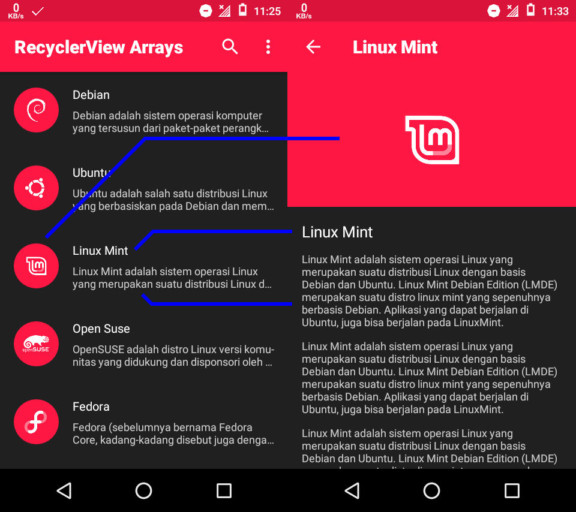
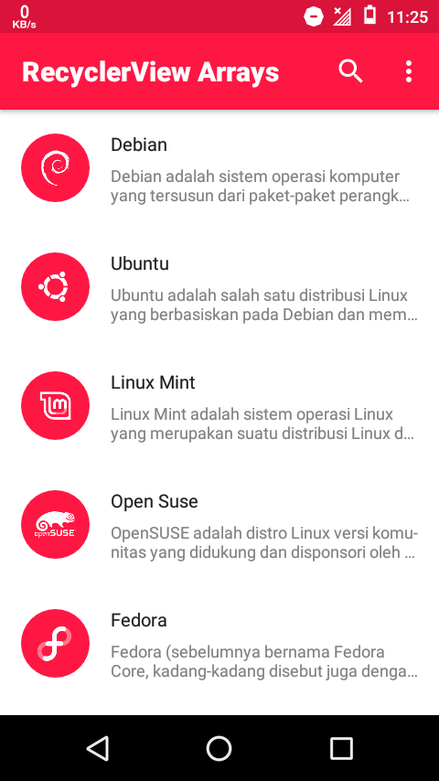

# RecyclerView with Arrays.xml #

Fitur :

- List RecyclerView on potrait / Grid on landscape
- Passing data [Image thumbnail]
- Passing data [Title]
- Passing data [Subtitle]
- Change theme dark/light

Edit :

Data array

`res/values/arrays.xml`

Length / panjang array

`java/material/wahyu/io/MainActivityAdapter.java`

